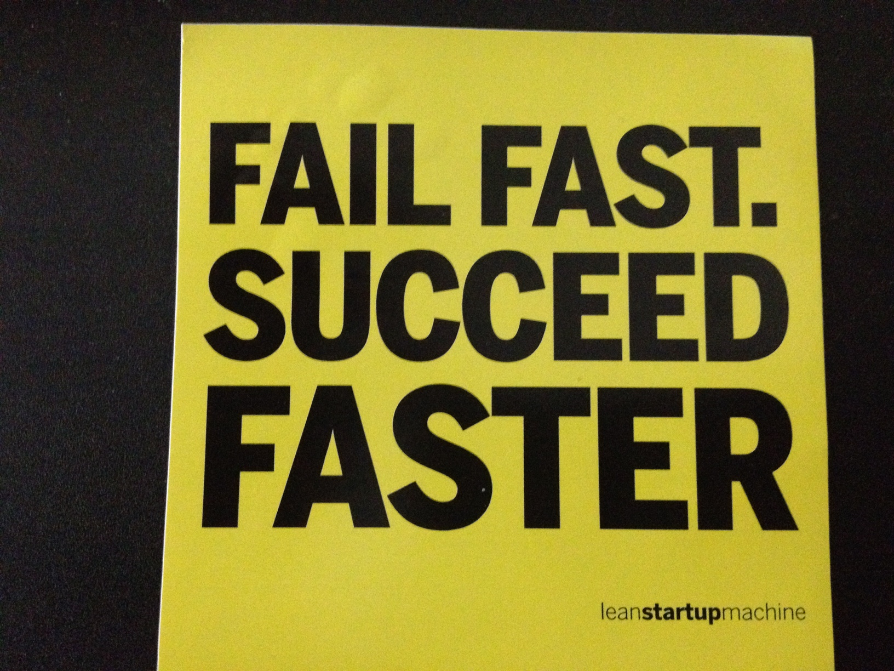

<aside class="notes">
The dirty little secret of programming is that anyone can do it. ANYONE. Programming is not difficult to learn. Programming is difficult to do well.

Be in a constant state of learning
Commit to your craft. 
</aside>
<div style="float: left"></div>
<div style="float: right"></div>

#BEWD - Working Like A Developer 

###Joe Leo

* Associate Vice President, Credit Suisse
* Instructor, General Assembly
* Rapper, Retired

---

##Agenda

*	Install
*	Intros
*	What is Web Development
*	Bash Commands
*	Using GitHub

---

##Installation
###Terminal
###Browser


This class is using Ruby 2.0 and Rails 4.0. We will use SublimeText2 for editing files.

1. Copy and paste the following in your command prompt and hit ENTER:
"\curl -L https://get.rvm.io | bash -s stable --ruby -s stable --rails"

2. Copy and paste the following in your browser and hit ENTER:
http://c758482.r82.cf2.rackcdn.com/Sublime%20Text%202.0.2.dmg

---

##Introductions

Birthdays!

1. Name
2. Occupation
3. What did you do on your last birthday?

---

##Course Administration

During this class we will learn command line, Git, Ruby, and Rails, in that order.

To pass the course: 

*	Complete 80% of all assigned homework
*	Complete final project

---

##Course Administration

What you will get from us

* 	In class labs
* 	Homework
* 	Slides / student handout to be viewed in GitHub
* 	Awesome instructor

---

##Web Development
###What is Back-End Web Development?


---
<aside class="notes">
It's true that every time you touch your mouse you are doing something inefficiently. There is almost nothing you do with a mouse that you can't do with the keyboard, including:
- Opening programs
- Surfing the web
- Navigating applications - GMail, GitHub, Twitter, etc...
</aside>

##Command Line
###Lets learn how to work like a programmer before we start to build web applications.


---

<aside class="notes">
Here is a picture of the first mouse, created in 1963 by Douglas Engelbart and Bill English. I'm including this clunky thing so that you can burn it into your memory. Every time you think of using your mouse, think of this thing. Use it as inspiration.
</aside>

##Command Line
###Why Work Like A Developer?

*	It's faster
	*	Working with the keyboard increases your speed. The mouse slows you down.

<div style="float: center"></div>


---

<aside class="notes">
I remember my first job at Cyrus Innovation. I was working with two developers that were light years ahead of me.
What could I do? I could learn keyboard shortcuts, simple tricks, memorization.
I could keep up and fail fast.
</aside>

<div style="float: center"></div>

---
##Command Line
###Why Work Like A Developer?

* It's more fun!
	*	Impress your friends as you navigate the computer using your keyboard.
  * Complete in seconds what takes "normals" minutes.


---
##Command Line


---

##Command Line
###How Do You Use It?

####Shell Commands.

---

<aside class="notes">
* cd - change directory; most commands are short for something so they can help as mnemonic devices. chmod - change mode; cat - catenate; mkdir, etc.
* notice what happens when I run my script more than once. (explain '>>' vs. '>')
* Change this to a ruby script (show ruby FileUtils: http://ruby-doc.org/stdlib-1.9.3/libdoc/fileutils/rdoc/FileUtils.html)
* Make a ruby script that simply does "puts"
</aside>


##Command Line Basics

---


## Command Line Basics Exercise

---


##Terminal
###Becoming a Hacker

*	This is enough to get you started on the road to great hacking.
	*	Keep practicing and see the cheat sheet in the handout for a list of common commands.
  * Every time your reach for your mouse, ask yourself if there's a better way. Better yet, ask Google.

---


##Git


---

<aside class="notes">
  Git is a version control system. And here's the official Wikipedia definition of version control, aka revision control. 
  Plenty of VCS out there: subversion, clearcase, mercurial, CVS. All of them try to accomplish the same thing.
  But the easiest way to think of version control is as change management. Let's take a look at what that may mean for you.
</aside>

##Git
###What Is git?

* A Version Control System
  * Version control: "is the management of changes to documents, computer programs, large web sites, and other collections of information." -- Wikipedia
  * Change management

---
##Git
###Why Use git?

* Keep Your Code Safe and Secure

---

<aside class="notes">
If you write a novel, you'd probably want to save it someplace other than your computer. You don't want to have to rewrite everything if something happens to your computer. Well developers don't want to lose their code, either. So the first thing version control provides is safety from loss. It also gives us checkpoints. Every so often, when we think we've done something worth saving, we can check it in.
</aside>

##Git
###Why Use git?
<div style="float: center"></div>

---

<aside class="notes">
Next, we developers want to be able to make changes. We want to test things out. And we want to be able to do it without any consequences. If I write a whole bunch of code that I don't like, we want to be able to get rid of it. Here, version control helps us, because we can easily discard our changes and start back from the last known good state.
</aside>

##Git
###Why Use git?
* Keep Your Code Safe and Secure
* Mistaek Proof Your Code

---

<aside class="notes">
We want to be able to experiment. Let's go back to the novel example. If you were writing a novel and you wanted to explore a character by delving into her past, what would you do? Maybe you'd save a different copy. Demonstrate file -> save as. Version Control is what developers use to accomplish this, and it beats the pants off of file -> save as... With git we simply make a branch and we work on that branch. If things work out, great! We integrate it back to the main story. If not, we can leave it, or throw it out, or do whatever we want with it. It will never interfere with our master copy of the code.
</aside>
##Git
###Why Use git?

<div style="float: center"></div>

---
##Git
###Why Use git?
* Keep Your Code Safe and Secure
* Mistaek Proof Your Code
* Make Your Code Easy to Change

---

<aside class="notes">
Finally, we want to be able to collaborate. Developers - the best developers in the world - work in teams. It's a concept you're going to get used to here in this class because it's a key to success in development. Version Control, particularly git, makes collaboration possible. We can share our code easily, change it together or separately, keep in sync. Git makes this possible and GitHub makes it easy!
</aside>


---
##Git
###Why Use git?
* Keep Your Code Safe and Secure
* Mistaek Proof Your Code
* Make Your Code Easy to Change
* Collaboration

---
##Git
###How does Git Work?


---


##Git Basics

---

<aside class="notes">
GitHub is a wonderful place. GitHub was invented by Chris Wanstrath, PJ Hyett, and Tom Preston-Werner. They started the company in 2008 and nobody was all that interested. But they kept at it, and those three guys wrote - in Ruby on Rails - a product that today has over 3 million users and is adding more than 10,000 a day. And what does it do? It helps you code. It helps people collaborate better than any tool ever has. So we're going to use it in this class.
</aside>
##GitHub
###What is GitHub?

*	Is Git the same as GitHub?


---


---

##GitHub
###FORKS


---


##Git In Class

---


## Git It Together

---
## Homework

*	Review command line and GitHub

---

<div id="resources">
## Resources: Command Line Basics & Git

Class is over, but here are some extra resources.

##Cheat Sheet

The terminal (command prompt on Windows) is the developer way of navigating your computer. You are probably used to using the graphical interface provided (Finder on a mac and MyComputer on Windows).

Here is a quick reference for some of the most common commands you will use in this class. 
Remember when you see ```“$”```in these notes that is the prompt, don’t type it.

####Navigation

How do I get into a folder?

  		$cd folder_name

Use quotation marks if your folder name has spaces.

How do I get to the parent folder?

		$cd ..

How do I see what is in the folder?

		$ls


How do I know what folder I am in?

		$pwd

How do I create a new folder?

		$mkdir folder_name


####Deleting - (Proceed With Caution)

How do I delete a folder?

		$rm -r folder_name

How do I delete a file?
		
		$rm -f file_name

How do I move a file?

		$mv file_name folder_name
The file is removed from the old location and moved to the new one.

You can rename a file the same way

		$mv old_name new_name


##Tips, Tricks & Motivation

__How is my instructor moving so fast?__

First, he takes control of his caps lock key: http://www.thegarvin.com/2010/08/04/remap-caps-lock-to-control.html

Then, he uses keyboard shortcuts to enter commands in the Terminal. Here are some to help you keep up:

**Tab Completion**: Press Tab to complete folder and file names                                                       

**Control + a**: Go to the beginning of the line                                                                      

**Control + e**: Go the the end of the line                                                                      

**Option + b**: Move back one word

**Option + f**: Move forward one word

**Control + p/n**: Repeats previous commands                                                               

**Control + w**: Delete last word typed

**Control + u**: Delete last line typed

**Control + y**: Paste last deleted item

**Control + l**: Clear the screen        
 
**Control + r**: Reverse search for previous commands


##Git Diagrams and Pictures

Fork Button


Pull Request Buttons


__Adding A Remote__

[GitHub help](https://help.github.com/articles/adding-a-remote)

##Still Feel Lost? 
###Catch Up With These Resources


-	[Command Line Crash Course](http://cli.learncodethehardway.org/book/)

-	[GitHub Cheat Sheet](https://na1.salesforce.com/help/doc/en/salesforce_git_developer_cheatsheet.pdf)

-	[Intro to Git Videos](http://git-scm.com/videos)

-	[Intro to Git Tutorial](http://www.codeschool.com/courses/try-git) from Code School.
